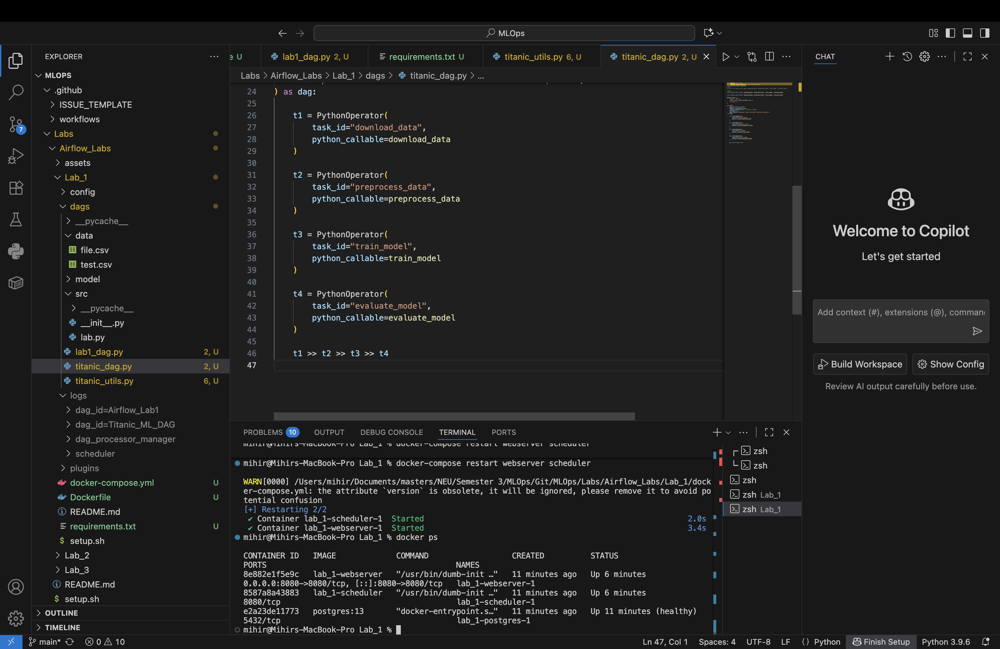

# 🚀 Titanic Survival Prediction Pipeline with Apache Airflow & Docker

This project automates a **machine learning workflow** for the Titanic dataset using **Apache Airflow** orchestrated inside Docker.

## 📌 What this project does
- Downloads the Titanic dataset
- Preprocesses the data (handling missing values, encoding categorical features)
- Trains a simple classification model to predict survival
- Evaluates and logs the accuracy

## 🛠️ Technologies
- **Apache Airflow** (task orchestration)
- **Docker & Docker Compose** (isolated, reproducible environment)
- **scikit-learn** (ML)
- **pandas** (data manipulation)
- **Python 3.9+**

## ⚡ Quick Start

```bash
# 1. Clone the repo
git clone https://github.com/mihir-parab30/titanic-ml-airflow-pipeline.git
cd titanic-ml-airflow-pipeline

# 2. Build and start services
docker-compose up -d --build

# 3. Open Airflow UI
# Visit http://localhost:8080
# Username: admin | Password: mypassword
```
## 📸 Screenshots

### Airflow DAGs List


### Titanic DAG Details


### DAG Graph View


### Logs Showing Model Accuracy


### Running Containers

